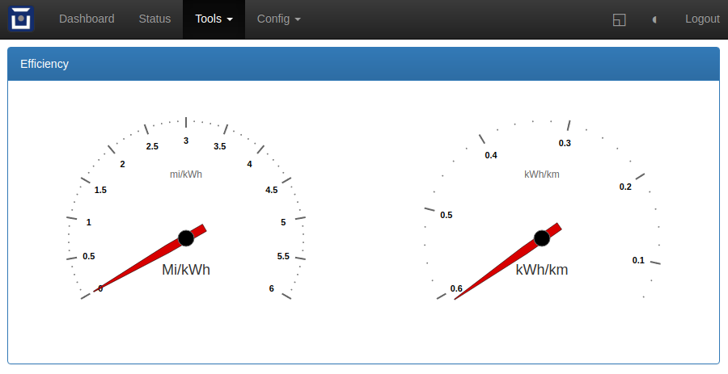

==============================
Efficiency: Efficiency Monitor
==============================

**Live monitoring for efficiency in mi/kWh and kWh/km**

This is a work in progress. I don't know what how to know the units for speed, whether mi/h or km/h. I aim to fix this soon.

download: `efficiency.htm`

and simply create a web plugin at /usr/efficiency in tools, no authentication

---

licenced under GPLv3 by Paul Mansfield paul/at/mansfield/dot/co/dot/uk
